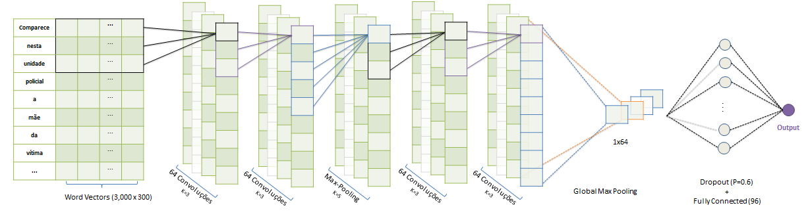
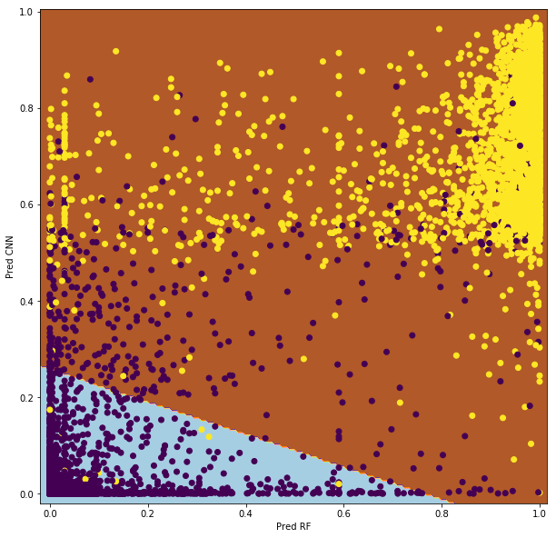

# Sistema de triagem automática de boletins de ocorrência do INFOSIGA
A equipe do INFOSIGA desenvolveu um modelo de aprendizado de máquina para realizar o processo de triagem de boletins de ocorrência da Polícia Cívil automaticamente. Atualmente o modelo identifica corretamente os boletins de ocorrência de trânsito com vítima fatal em 99,7% dos casos, garantindo também que 90% dos boletins de ocorrência passados da triagem para a tabulação manual sejam de fato acidentes de trânsito com vítima fatal.

## Sistema INFOSIGA
O [INFOSIGA SP](http://www.infosiga.sp.gov.br/) é um banco de dados que reúne mensalmente informações referentes a óbitos no trânsito no Estado de São Paulo. Os dados são obtidos a partir dos Boletins de Ocorrência do sistema Registro de Ocorrências (RDO) utilizado pela Polícia Civil na elaboração de Boletins de Ocorrência em todo o Estado de São Paulo.

## Triagem automática
O sistema de triagem recebe mais de 2 mil boletins de ocorrência da Polícia Civil todos os meses. 
Esse conjunto de dados é encaminhado para a equipe de tabuladores do INFOSIGA que extraem as informações do boletim de ocorrência.

Desta massa de 2 mil boletins de ocorrência, apenas cerca de 24% são casos de acidentes de trânsito com vítima fatal. O Sistema de Triagem Automática permite reduzir a chance de um tabulador perder um boletim de ocorrência relacionado e ao mesmo tempo reduzir a carga de leitura dos trabalhadores em 64%.

##  Modelo
O modelo adotado é um [*ensemble*](https://en.wikipedia.org/wiki/Ensemble_learning) de uma Rede Neural com Convoluções e uma *Random Forest*, ambas treinadas com 73 mil boletins de ocorrência.

### Convolutional Neural Network

#### Pré-processamento
A rede neural obtém os textos truncados com um limite máximo de 3 mil palavras. 

Verificou-se que incluir conjuntamente uma versão modificada do texto, após passar por um processo de *stemming*, no final do BO provocou ganhos significativos de performance.

#### WordVectors
*Word Vectors* são [representações multidimensionais de palavras](https://en.wikipedia.org/wiki/Word_embedding), usadas no sistema de triagem automática. **Os *word vectors* utilizados pelo INFOSIGA estão disponíveis para *download*, veja mais em [wordvectors](https://github.com/INFOSIGA/TriagemAutom/blob/master/doc/wordvectors.md)**

No vocabulário dos *WordVectors* são incluidos os vetores das palavras transformadas após o processo de [*stemming*](https://pt.wikipedia.org/wiki/Stemiza%C3%A7%C3%A3o), tal que a versão transformada possua o mesmo vetor da versão original da palavra. 

Para palavras distintas que possuem mesma [raiz](https://pt.wikipedia.org/wiki/Radical_(lingu%C3%ADstica)#Raiz_e_radical), o vetor resultante (versão após *stemming*) é definido pela mediana do conjunto vetores de palavras de raiz igual.

#### Arquitetura

A arquitetura da rede neural seguiu os padrões usuais para problemas de classificação de texto. A primeira etapa é transformar as palavras pré-processadas em *wordvectors*. A sequência de *wordvectors* passa pelas seguintes camadas:

* 64 Convoluções (com janela de 3 palavras)
* 64 Convoluções (com janela de 3 unidades)
* [*Max-Pooling*](https://en.wikipedia.org/wiki/Convolutional_neural_network#Pooling_layer) com janela de 5 unidades
* 64 Convoluções (com janela de 3 unidades)
* 64 Convoluções (com janela de 3 unidades)
* Max-Pooling global: O valor máximo de cada um dos 64 outputs da camada anterior 
* [Dropout](https://en.wikipedia.org/wiki/Dropout_(neural_networks)) (com probabilidade 0,6)
* Rede neural com 96 neurônios

### Random Forest
Foi ajustado um modelo [*Random Forest*](https://dl.acm.org/citation.cfm?id=570182), usando a metodologia  [*Bag-of-Words*](https://en.wikipedia.org/wiki/Bag-of-words_model) após pré-processar o texto via *stemming* ([Snowball](http://snowballstem.org/)). 

As 1,000 *features* foram transformadas usando a transformação [TF-IDF](https://en.wikipedia.org/wiki/Tf%E2%80%93idf), e posteriormente foram reduzidas num processo de [seleção de *features*](https://en.wikipedia.org/wiki/Feature_selection) para um total de 80 *features*. O processo de treinamento do modelo utilizou *pruning* com taxa de 10%.

### Ensemble
Para combinar o *output* dos dois modelos, levou-se em consideração que os dois tipos possíveis de erro que o modelo pode cometer (falso-positivos e falso-negativos) possuem importâncias muito diferentes.

No contexto do problema, um falso-negativo (perda de um boletim de ocorrência de trânsito) é muito pior que um falso-positivo (um boletim de ocorrência não relacionado ser passado para a equipe de tabuladores). 
Pensando-se nisso, foi definida como taxa de [*recall*](https://pt.wikipedia.org/wiki/Recall) mínima aceitável para este problema o valor de 99,7%.

Para garantir a robustez do modelo, os erros cometidos pelo classificador foram verificados pela equipe do INFOSIGA e posteriormente julgados nos critérios de dificuldade e excepcionalidade. A partir dos resultados desta análise, um critério de decisão para o *ensemble* foi criado manualmente tal que os erros cometidos correspondam apenas a casos limítrofes.

### Performance medida

No gráfico acima, cada ponto representa um boletim de ocorrência.  O modelo procura filtrar apenas os casos em que existe certeza muita alta do boletim de ocorrência não ser relacionado (região em azul claro). Os casos restantes (região em marrom) são dirigidos para uma equipe de tabuladores que efetuam uma triagem manual e a tabulação dos dados. 

O modelo final (figura acima) obteve 99,7% de [*class-recall*](https://en.wikipedia.org/wiki/Precision_and_recall) e garantiu também que 90% dos casos dirigidos à equipe de tabuladores sejam de fato acidentes de trânsito.

## Referências
[1] [Tomas Mikolov,  Efficient Estimation of Word Representations in Vector Space, 2013](https://arxiv.org/abs/1301.3781)

[2] [Stéphane Mallat. Understanding deep convolutional networks. arXiv preprint arXiv:1601.04920, 2016](https://arxiv.org/pdf/1601.04920.pdf)

[3] [Breiman, L. (2001) Random forests. Machine Learning, 45, 5-32. doi:10.1023/A:1010933404324](https://link.springer.com/article/10.1023%2FA%3A1010933404324)

